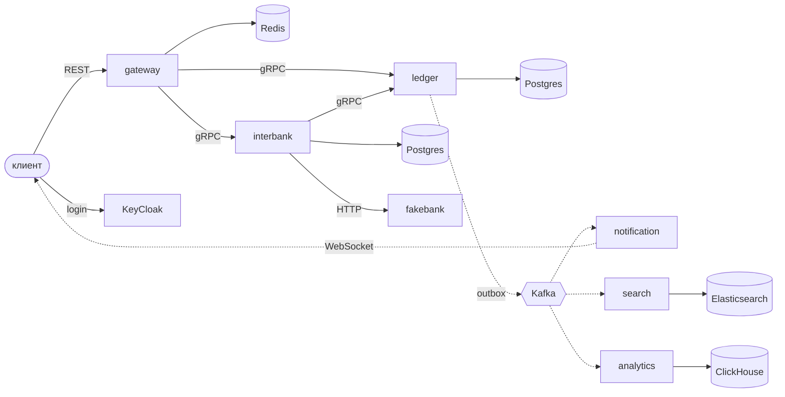

# Архитектура

Equilibra - платёжный сервис с внутренними счетами на double-entry ledger.
Баланс нигде не хранится, а считается из проводок. Сумма проводок любой транзакции равна 0.

Сейчас реализован только ledger (REST API + PostgreSQL). Ниже целевая схема.

## Схема

## Сервисы

- **gateway** - вход снаружи: роутинг, проверка JWT, rate limit в Redis. Своих данных нет.
- **KeyCloak** - пользователи и токены.
- **ledger** - счета, транзакции, проводки. Переводы, пополнения, выводы, баланс,
  выписка, резервы под межбанковские переводы.
- **interbank** - переводы в другие банки, своя БД со статусами переводов.
- **fakebank** - заглушка внешнего банка, отвечает медленно и с ошибками.
- **notification** - уведомления по WebSocket, читает события из Kafka.
- **search** - поиск по операциям, копия данных в Elasticsearch.
- **analytics** - отчёты, копия данных в ClickHouse.

У каждого сервиса своя БД, в чужие напрямую никто не ходит.
У счёта в ledger хранится id владельца из KeyCloak (`sub` из JWT).

## Почему ledger не делится

Всё, от чего зависит, можно ли провести операцию, должно быть строго согласовано,
поэтому живёт в одной БД и одной транзакции: переводы, проверка баланса под
`FOR UPDATE`, резервы, лимиты, выписка (пользователь должен сразу видеть свою операцию).
Если разделить ledger, понадобятся распределённые транзакции.

Остальное может отставать, поэтому вынесено отдельно: уведомления и поиск на секунды,
аналитика на минуты.

## Связи

- снаружи REST/JSON
- внутри синхронно gRPC: gateway -> ledger, gateway -> interbank, interbank -> ledger
- interbank -> fakebank по HTTP, как с настоящим внешним банком
- асинхронно через Kafka: ledger публикует `transaction.completed` и `transaction.reversed`,
  их читают notification, search и analytics. Ledger про них не знает и от них не зависит.

Событие: `event_id`, `type`, `transaction_id`, `transaction_type`, `source_id`,
`destination_id`, `amount`, `currency`, `reversal_of`, `occurred_at`.
Ключ партиции - id счёта, чтобы события одного счёта шли по порядку.

## Outbox

Отправлять событие в Kafka прямо из транзакции нельзя. До коммита можно отправить
событие о транзакции, которая потом откатится. После коммита событие потеряется,
если процесс упадёт между коммитом и отправкой.

Поэтому событие пишется в таблицу `outbox` в той же транзакции, что и проводки.
Отдельный relay читает её через `FOR UPDATE SKIP LOCKED` (чтобы несколько копий не брали
одни и те же строки) и отправляет в Kafka. Доставка at-least-once, потребители
отбрасывают повторы по `event_id`.

CDC (Debezium) не используется: лишняя инфраструктура ради того же результата.

## Межбанковский перевод

1. interbank резервирует деньги в ledger: со счёта пользователя на транзитный счёт (`pending`)
2. отправляет перевод в fakebank со своим id как ключом идемпотентности (`sent`)
3. дальше по ответу:
   - успех: деньги с транзитного счёта уходят на счёт внешних расчётов (`completed`)
   - отказ: деньги возвращаются пользователю (`failed`)
   - таймаут: исход неизвестен. Повторяем запрос с тем же ключом и спрашиваем статус.
     Что зависло надолго, разбирается сверкой.

Внутренние переводы от fakebank не зависят.

## Масштабирование

Состояние лежит в Postgres, Redis и Kafka, поэтому сервисы можно запускать в нескольких копиях.

- ledger: блокировки в БД работают и между копиями
- gateway: счётчики rate limit в Redis, иначе у каждой копии был бы свой лимит
- notification: WebSocket-соединение живёт в конкретной копии. Как доставить событие
  именно ей (каждая копия читает все события или маршрутизация через Redis pub/sub) -
  пока открытый вопрос.

Liveness-проверка не трогает БД, readiness проверяет.

## Если что-то упало

- gateway: снаружи недоступно всё
- ledger: деньги не ходят
- KeyCloak: работают уже выданные токены (gateway проверяет JWT сам), новых входов нет
- Redis: rate limit отключается, остальное работает
- Kafka: деньги ходят, события копятся в outbox
- notification, search, analytics: после рестарта дочитают пропущенные события
- interbank, fakebank: внутренние переводы работают, межбанковские ждут
